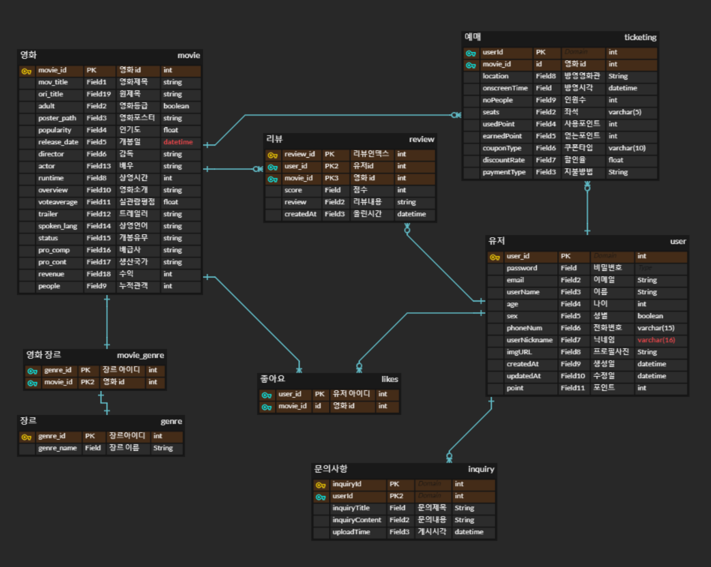

# Megabox

## 개발 준비 단계

#### 1) ER-Diagram

#### 2) UML 클래스 다이어그램

1. Model

   | USER                                                         |
   | ------------------------------------------------------------ |
   | int user_id String password String email String userName int age boolean sex String phoneNum String userNickname String img_url Date createdAt Date updatedAt int point |
   | public User()                                                |

   | MOVIE                                                        |
   | ------------------------------------------------------------ |
   | int movie_id String movie_title String ori_title boolean adult String poster_path float popularity Date release_date String director Strinor int genre int runtime  String overview float voteaverage String trailer String spoken_lang String status String pro_comp String pro_cont int revenue int people |
   | public movie()                                               |

   | GENRE                               |
   | ----------------------------------- |
   | int genre_id String genre_name |
   | public genre()                      |

   | MOVIE_GENRE                                   |
   | --------------------------------------------- |
   | int mg_id int movie_id int genre_id |
   | public Movie_genre()                          |

   | TICKETING                                                    |
   | ------------------------------------------------------------ |
   | int ticket_id int user_id int movie_id String location Datetime onscreenTime int noPeople String seats int usedPoint int earnedPoint String couponType float discountRate String paymentMethod |
   | public Ticketing()                                           |

   | REVIEW                                                       |
   | ------------------------------------------------------------ |
   | int review_id int user_id int movie_id float score String review Datetime createdAt |
   | public Review()                                              |

   | INQUIRY                                                      |
   | ------------------------------------------------------------ |
   | int inquiry_id int user_id String inquiryTitle String inquiryContent Datetime createdAt |
   | public Inquiry()                                             |

   | LIKE                          |
   | ----------------------------- |
   | int user_id int movie_id |
   | public Like()                 |

   